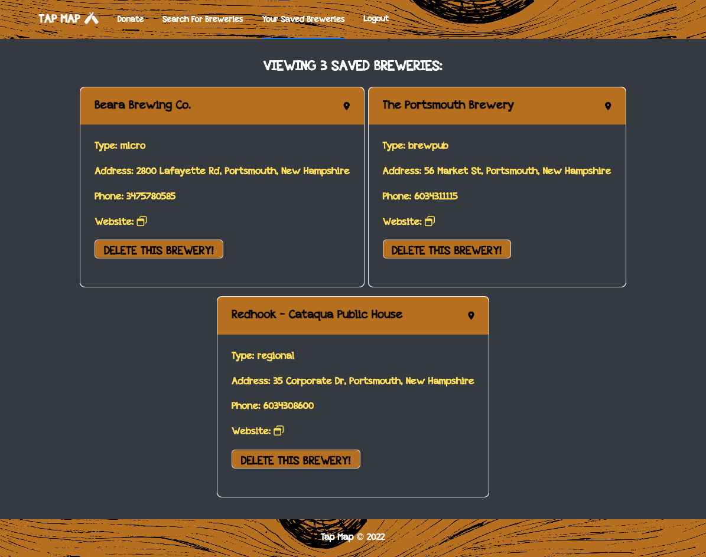

# Tap Map

## Table of Contents
* [Description](#description)
* [Installation instructions](#installation-instructions)
* [Usage Information](#usage-information)
* [License](#license)
* [Contribution Guidelines](#contribution-guidelines)
* [Test Instructions](#test-instructions)
* [Questions](#questions)

## Description
Tap Map is your go-to app for locating breweries across the nation! This is a MERN-stack single-page app, combining a scalable MongoDB back end, a GraphQL API, and an Express.js and Node.js server with a React front end that uses Ant Design for the CSS framework. This app also implements authentication with JSON Web Tokens (JWT).

Third Party API Credit to [OPEN BREWERY DB.](https://www.openbrewerydb.org)

## Installation Instructions
N/A

## Usage Information
[Click here to check out the app!](https://tap-map-app.herokuapp.com/)

To get started, create an account. Then, click on 'Search For Breweries' and enter in a zipcode to search for businesses in that area. If you want to keep track of any breweries you find, save it and revisit your saved choices under 'Your Saved Breweries'!

## License
[MIT](https://opensource.org/licenses/MIT)

## Contribution Guidelines
N/A

## Test Instructions
N/A

